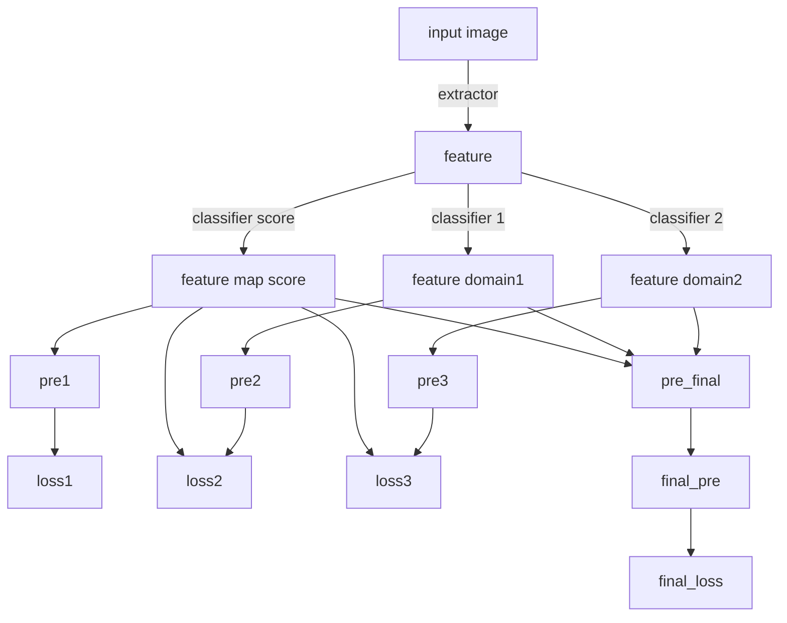

# inner-mutil-domain-for-color-constancy

```mermaid
flowchart TD;
       I[input image] -- extractor --> F[feature]
       F -- classifier score --> F1[feature map score]
       F -- classifier 1 --> F2[feature domain1]
       F -- classifier 2 --> F3[feature domain2]
       F1 --> pre1 --> loss1
       F1 --> loss2  & loss3
       F2 --> pre2 --> loss2 
       F3 --> pre3 --> loss3
       F1 & F2 & F3 --> pre_final --> final_pre --> final_loss
       
```
